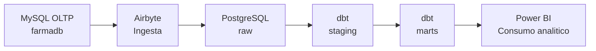

# farmacia-bi

Laboratorio BI para construir un flujo completo desde una base transaccional hasta un DW/DataMart explotable en Power BI.

## Flujo general

```text
MySQL OLTP -> Airbyte -> PostgreSQL DW -> dbt -> Power BI
```

## Arquitectura global



## Rol de este README

Este `README.md` de la raiz funciona como:

- portal principal del repositorio
- mapa de arquitectura
- mapa de navegacion
- punto de partida para estudiantes y docentes

El detalle operativo de cada modulo vive en su propio `README`.
La explicacion didactica paso a paso vive en los archivos `SESION_...md`.

## Estructura del proyecto

```text
farmacia-bi/
├── oltp-mysql/
├── dw-pg/
├── ingesta-airbyte/
├── dw-dbt/
└── powerbi/
```

## Que contiene cada carpeta

- `oltp-mysql/`: origen transaccional MySQL con la base `farmadb` y la fase manual del DW
- `dw-pg/`: PostgreSQL analitico con la base `farmacia_dw`
- `ingesta-airbyte/`: modulo de ingesta con Airbyte
- `dw-dbt/`: proyecto dbt para construir `staging` y `marts`
- `powerbi/`: capa final de consumo y visualizacion

## Arquitectura logica

En este proyecto:

- `farmadb` en MySQL representa el OLTP
- Airbyte replica hacia PostgreSQL
- PostgreSQL se organiza en tres schemas:
  - `raw`
  - `staging`
  - `marts`

Equivalencia conceptual:

- `raw` = `Bronze`
- `staging` = `Silver`
- `marts` = `Gold`

## Orden recomendado de trabajo

Sigue este orden:

1. `oltp-mysql/`
2. `dw-pg/`
3. `ingesta-airbyte/`
4. `dw-dbt/`
5. `powerbi/`

Para los comandos operativos concretos, revisa el `README.md` de cada carpeta.

## Unidad 2 congelada

La Unidad 2 queda organizada en dos sesiones principales:

- `Sesion 6 - Implementacion manual del DW con SQL`
- `Sesion 7 - Implementacion del pipeline BI con herramientas`

Documentos de apoyo en la raiz:

- [UNIDAD_2_SESION_1.md](UNIDAD_2_SESION_1.md)
- [UNIDAD_2_SESION_2.md](UNIDAD_2_SESION_2.md)

## Mapa de guias por carpeta

```text
farmacia-bi/
├── oltp-mysql/
│   ├── SESION_U2_S1_P1_IMPLEMENTACION_FISICA_MANUAL_DEL_DATAMART_DENTRO_DEL_MISMO_OLTP.md
│   ├── SESION_U2_S1_P2_ETL_MANUAL_CON_SQL_PARA_DIMENSIONES_Y_HECHO_MEDIANTE_LA_VISTA_G.md
│   └── SESION_U2_S1_P3_VALIDACION_ANALITICA_DEL_DATAMART_MANUAL.md
├── ingesta-airbyte/
│   └── SESION_U2_S2_P1_AIRBYTE_REPLICA_MYSQL_POSTGRES.md
├── dw-dbt/
│   ├── SESION_U2_S2_P2_DBT_MODELADO_FISICO_DATAMART.md
│   └── SESION_U2_S2_P3_VALIDACION_ANALITICA_DEL_DATAMART.md
└── powerbi/
```

## READMEs de modulo

Cada `README` de carpeta sigue este criterio:

- onboarding del modulo
- operacion minima
- integracion con el resto del proyecto
- validacion minima
- instalacion, solo cuando el modulo lo requiere

## Nota final

Si encuentras material historico de etapas previas, tomalo solo como referencia y no como ruta principal del laboratorio actual.
