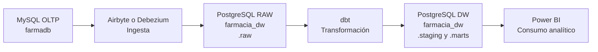

# farmacia-bi

Laboratorio BI para construir un pipeline BI completo desde una base transaccional hasta un DW/DataMart explotable en Power BI.

## Flujo general

```text
MySQL OLTP -> Airbyte o Debezium -> PostgreSQL RAW -> dbt -> PostgreSQL DW -> Power BI
```

## Arquitectura global



## Estructura del proyecto

```text
farmacia-bi/
├── oltp-mysql/
├── dw-pg/
├── ingesta-airbyte/
├── ingesta-debezium/
├── dw-dbt/
└── powerbi/
```

## Qué contiene cada carpeta

- `oltp-mysql/`: origen transaccional MySQL con la base `farmadb` y la fase manual del DW
- `dw-pg/`: PostgreSQL analítico con la base `farmacia_dw`
- `ingesta-airbyte/`: módulo de ingesta con Airbyte
- `ingesta-debezium/`: módulo complementario para CDC con Debezium y Kafka
- `dw-dbt/`: proyecto dbt para construir `staging` y `marts`
- `powerbi/`: capa final de consumo y visualización

## Arquitectura lógica

En este proyecto:

- `farmadb` en MySQL representa el OLTP
- Airbyte o Debezium replican hacia PostgreSQL
- PostgreSQL se organiza en tres schemas:
  - `raw`
  - `staging`
  - `marts`

Equivalencia conceptual:

- `raw` = `Bronze`
- `staging` = `Silver`
- `marts` = `Gold`

## Orden recomendado de trabajo

Sigue este orden:

1. `oltp-mysql/`
2. `dw-pg/`
3. `ingesta-airbyte/` o `ingesta-debezium/`
4. `dw-dbt/`
5. `powerbi/`

Para los comandos operativos concretos, revisa el `README.md` de cada carpeta.

## Unidad 2 congelada

La Unidad 2 queda organizada en siete sesiones principales:

- `Sesión 6 - Implementación manual del DW con SQL`
- `Sesión 7 - Implementación del pipeline BI con herramientas`
- `Sesión 8 - Modelo semántico y métricas BI`
- `Sesión 9 - Exploración OLAP, hallazgos y storytelling BI`
- `Sesión 10 - Dashboard BI con KPIs y visualización base`
- `Sesión 11 - Gobierno del dato en BI`
- `Sesión 12 - Evaluación U2`

Documentos de apoyo en la raíz:

- [UNIDAD_2_SESION_1.md](UNIDAD_2_SESION_1.md)
- [UNIDAD_2_SESION_2.md](UNIDAD_2_SESION_2.md)
- [UNIDAD_2_SESION_3.md](UNIDAD_2_SESION_3.md)
- [UNIDAD_2_SESION_4.md](UNIDAD_2_SESION_4.md)
- [UNIDAD_2_SESION_5.md](UNIDAD_2_SESION_5.md)
- [UNIDAD_2_SESION_6.md](UNIDAD_2_SESION_6.md)
- [UNIDAD_2_SESION_7.md](UNIDAD_2_SESION_7.md)

## Mapa de guías por carpeta

```text
farmacia-bi/
├── oltp-mysql/
│   ├── SESION_U2_S1_P1_IMPLEMENTACION_FISICA_MANUAL_DEL_DATAMART_DENTRO_DEL_MISMO_OLTP.md
│   ├── SESION_U2_S1_P2_ETL_MANUAL_CON_SQL_PARA_DIMENSIONES_Y_HECHO_MEDIANTE_LA_VISTA_G.md
│   └── SESION_U2_S1_P3_VALIDACION_ANALITICA_DEL_DATAMART_MANUAL.md
├── ingesta-airbyte/
│   └── SESION_U2_S2_P1_AIRBYTE_REPLICA_MYSQL_POSTGRES.md
├── dw-dbt/
│   ├── SESION_U2_S2_P2_DBT_MODELADO_FISICO_DATAMART.md
│   └── SESION_U2_S2_P3_VALIDACION_ANALITICA_DEL_DATAMART.md
├── ingesta-debezium/
│   └── SESION_U2_S2_P4_CDC_CARGA_INCREMENTAL_Y_SCD.md
└── powerbi/
```

Guías de `powerbi/` para la Sesión 8:

- [powerbi/SESION_U2_S3_P1_MODELO_SEMANTICO_POWER_BI.md](powerbi/SESION_U2_S3_P1_MODELO_SEMANTICO_POWER_BI.md)
- [powerbi/SESION_U2_S3_P2_MEDIDAS_DAX_Y_AGREGACIONES.md](powerbi/SESION_U2_S3_P2_MEDIDAS_DAX_Y_AGREGACIONES.md)

Nota: los archivos con sufijo `_vAnterior` se conservan temporalmente como referencia historica; la ruta oficial usa los archivos sin sufijo.

Guías de `powerbi/` para la Sesión 9:

- [powerbi/SESION_U2_S4_P1_EXPLORACION_OLAP_STORYTELLING_POWER_BI.md](powerbi/SESION_U2_S4_P1_EXPLORACION_OLAP_STORYTELLING_POWER_BI.md)

Guías de `powerbi/` para la Sesión 10:

- [powerbi/SESION_U2_S5_P1_DASHBOARD_KPIS_VISUALIZACION_BI.md](powerbi/SESION_U2_S5_P1_DASHBOARD_KPIS_VISUALIZACION_BI.md)
- [powerbi/SESION_U2_S5_P2_DASHBOARD_KPIS_VISUALIZACION_BI.md](powerbi/SESION_U2_S5_P2_DASHBOARD_KPIS_VISUALIZACION_BI.md)

Guías de `powerbi/` para la Sesión 11:

- [powerbi/SESION_U2_S6_P1_GOBIERNO_DEL_DATO_BI.md](powerbi/SESION_U2_S6_P1_GOBIERNO_DEL_DATO_BI.md)

Guías de `powerbi/` para la Sesión 12:

- [powerbi/SESION_U2_S7_P1_EVALUACION_U2_BI_END_TO_END.md](powerbi/SESION_U2_S7_P1_EVALUACION_U2_BI_END_TO_END.md)

## READMEs de módulo

Cada `README` de carpeta sigue este criterio:

- onboarding del módulo
- operación mínima
- integración con el resto del proyecto
- validación mínima
- instalación, solo cuando el módulo lo requiere

## Nota final

Si encuentras material histórico de etapas previas, tómalo solo como referencia y no como ruta principal del laboratorio actual.
