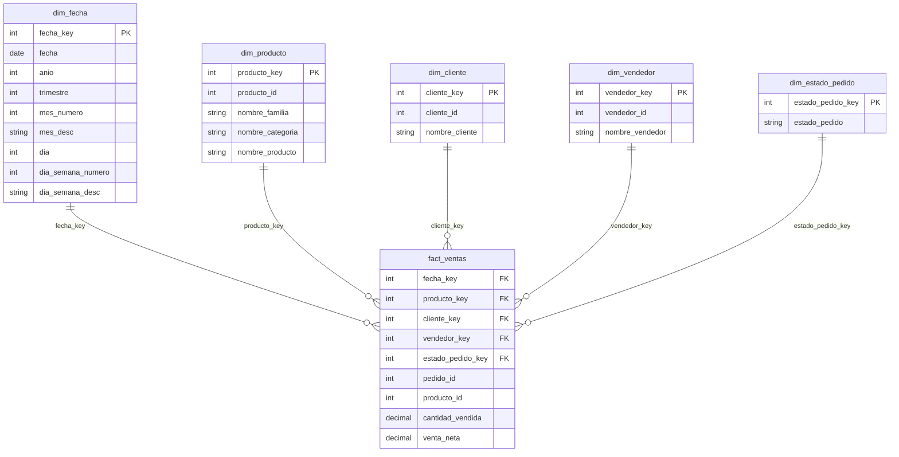

# Sesión U2 S3 P1: Modelo semántico en Power BI v2

## 1. Título

Construcción del modelo semántico BI en Power BI a partir del DataMart `marts`.

## 2. Objetivo

Conectar Power BI al DataMart en PostgreSQL y dejar un modelo estrella limpio, navegable y listo para construir medidas DAX.

Al finalizar la práctica, el alumno debe poder:

- conectarse a PostgreSQL desde Power BI
- cargar solo las tablas analíticas del schema `marts`
- reconocer dimensiones y tabla de hechos
- crear relaciones de uno a muchos
- identificar el grano de `fact_ventas`
- ocultar campos técnicos
- ordenar correctamente atributos temporales
- crear jerarquías de fecha y producto
- validar que el modelo responde a filtros desde dimensiones

## 3. Punto de partida

Esta práctica continúa desde el DataMart construido con dbt:

```text
MySQL -> Airbyte o Debezium -> PostgreSQL raw -> dbt staging -> dbt marts -> Power BI
```

Antes de iniciar, valida en PostgreSQL:

```sql
SELECT COUNT(*) FROM marts.fact_ventas;
SELECT COUNT(*) FROM marts.dim_fecha;
SELECT COUNT(*) FROM marts.dim_producto;
```

Tablas que se importarán:

- `marts.dim_fecha`
- `marts.dim_producto`
- `marts.dim_cliente`
- `marts.dim_vendedor`
- `marts.dim_estado_pedido`
- `marts.fact_ventas`

## 4. Conexión desde Power BI

En Power BI Desktop:

1. Selecciona `Obtener datos`.
2. Elige `Base de datos PostgreSQL`.
3. Usa:

```text
Servidor: 127.0.0.1:15432
Base de datos: farmacia_dw
Usuario: postgres
Password: postgres
```

Selecciona modo `Importar`.

No cargues tablas de:

- `raw`
- `staging`

El reporte debe consumir la capa `marts`.

## 5. Modelo estrella esperado

Tabla de hechos:

- `fact_ventas`

Dimensiones:

- `dim_fecha`
- `dim_producto`
- `dim_cliente`
- `dim_vendedor`
- `dim_estado_pedido`

Diagrama del modelo:



Configuración:

- cardinalidad: `Uno a varios`
- dirección de filtro: `Simple`
- relación activa: `Sí`

## 6. Grano de la tabla de hechos

El grano de `fact_ventas` es:

```text
una fila por línea de pedido por producto
```

Esto significa:

- un `pedido_id` puede repetirse
- un pedido puede tener varios productos
- las ventas se suman por línea
- los pedidos se cuentan con `DISTINCTCOUNT`

## 7. Campos visibles y ocultos

Oculta claves técnicas usadas para relaciones:

- `fact_ventas[fecha_key]`
- `fact_ventas[producto_key]`
- `fact_ventas[cliente_key]`
- `fact_ventas[vendedor_key]`
- `fact_ventas[estado_pedido_key]`

También puedes ocultar claves de dimensiones:

- `cliente_key`
- `producto_key`
- `vendedor_key`
- `estado_pedido_key`
- `cliente_id`
- `producto_id`
- `vendedor_id`
- `categoria_id`
- `familia_id`

Deja visibles los campos de negocio:

- `dim_fecha[fecha]`
- `dim_fecha[anio]`
- `dim_fecha[trimestre]`
- `dim_fecha[mes_desc]`
- `dim_fecha[dia_semana_desc]`
- `dim_producto[nombre_familia]`
- `dim_producto[nombre_categoria]`
- `dim_producto[nombre_producto]`
- `dim_cliente[nombre_cliente]`
- `dim_vendedor[nombre_vendedor]`
- `dim_estado_pedido[estado_pedido]`

## 8. Orden semántico de fechas

Configura `No resumir` en:

- `dim_fecha[anio]`
- `dim_fecha[trimestre]`
- `dim_fecha[mes_numero]`
- `dim_fecha[dia]`
- `dim_fecha[dia_semana_numero]`

Ordena:

```text
dim_fecha[mes_desc]         por dim_fecha[mes_numero]
dim_fecha[dia_semana_desc]  por dim_fecha[dia_semana_numero]
```

Esto evita que Power BI ordene meses o días como texto.

### 8.1 Actividad: orden temporal del día de semana

Crea una tabla simple.

Filas:

- `dim_fecha[dia_semana_desc]`

Valores:

- suma de `fact_ventas[venta_neta]`

Pregunta:

```text
¿Qué sucede con el informe?
```

Si los días aparecen en orden alfabético, corrige:

1. Ve a la vista `Datos`.
2. Selecciona `dim_fecha[dia_semana_desc]`.
3. Elige `Ordenar por columna`.
4. Selecciona `dim_fecha[dia_semana_numero]`.
5. Regresa al informe.

Resultado esperado:

```text
domingo
lunes
martes
miércoles
jueves
viernes
sábado
```

Pregunta final:

```text
¿Cambió el dato o cambió la forma correcta de leerlo?
```

La respuesta esperada: cambió la forma correcta de leerlo. Los importes no cambiaron; cambió el orden de presentación.

## 9. Jerarquías

Crea la jerarquía:

```text
Calendario
  anio
  trimestre
  mes_desc
  fecha
```

Crea la jerarquía:

```text
Producto Comercial
  nombre_familia
  nombre_categoria
  nombre_producto
```

No uses la jerarquía automática de fechas como jerarquía oficial del curso.

## 10. Formatos semánticos

Configura el formato de los campos numéricos visibles. Esta configuración forma parte del modelo semántico porque define cómo se leerán los datos en cualquier visual.

Columnas base:

- moneda: `fact_ventas[venta_neta]`
- entero o número sin decimales: `fact_ventas[pedido_count]`
- entero o número sin decimales: `fact_ventas[cantidad_vendida]`

Columnas opcionales:

- moneda: `fact_ventas[venta_bruta]`
- moneda: `fact_ventas[descuento_total]`
- moneda: `fact_ventas[costo_total]`
- moneda: `fact_ventas[margen_bruto]`
- porcentaje: `fact_ventas[pct_margen_bruto]`

Cuando se creen medidas en la siguiente práctica, usa el mismo criterio:

- moneda: `[Ventas Netas]`, `[Ticket Promedio]`
- entero: `[Pedidos]`, `[Unidades Vendidas]`
- moneda opcional: `[Ventas Brutas]`, `[Descuentos]`, `[Costo Total]`, `[Margen Bruto]`
- porcentaje opcional: `[% Margen Bruto]`

## 11. Validación visual del modelo

En una página temporal, arma una validación rápida del modelo. Esta página no es todavía el dashboard final; solo sirve para comprobar que las relaciones, jerarquías y filtros funcionan correctamente.

### 11.1 Segmentador por año

Agrega un `Segmentador`.

Campo:

- `dim_fecha[anio]`

Configúralo como lista o mosaico.

Resultado esperado:

- aparecen los años disponibles
- al seleccionar un año, cambian el gráfico y la matriz
- no necesitas filtrar directamente la tabla de hechos

### 11.2 Gráfico de ventas por mes y año

Agrega un `Gráfico de líneas`.

Configura:

- Eje X: `dim_fecha[mes_desc]`
- Eje Y: suma de `fact_ventas[venta_neta]`
- Leyenda: `dim_fecha[anio]`

Verifica que `dim_fecha[mes_desc]` esté ordenado por `dim_fecha[mes_numero]`.

Resultado esperado:

- los meses aparecen de enero a diciembre
- cada año se muestra como una línea diferente
- 2026 aparece solo hasta el mes disponible en los datos

Pregunta de interpretación:

```text
¿Se puede comparar 2026 contra 2024 o 2025 como si fuera un año completo?
```

Respuesta esperada:

```text
No. 2026 todavía es un año parcial; la comparación debe leerse hasta el mismo periodo o aclarar que el año está incompleto.
```

### 11.3 Matriz calendario

Agrega una `Matriz`.

Filas:

- jerarquía `Calendario`

Valor:

- suma de `fact_ventas[venta_neta]`

Expande la jerarquía hasta:

```text
anio
trimestre
mes_desc
fecha
```

Resultado esperado:

- puedes navegar de año a trimestre, mes y fecha
- el subtotal de cada nivel se calcula automáticamente
- el modelo responde correctamente desde `dim_fecha` hacia `fact_ventas`

### 11.4 Tablas de control

Agrega una tabla simple por mes.

Campos:

- `dim_fecha[mes_desc]`
- suma de `fact_ventas[venta_neta]`

Agrega otra tabla simple por día de semana.

Campos:

- `dim_fecha[dia_semana_desc]`
- suma de `fact_ventas[venta_neta]`

Resultado esperado:

- los meses respetan el orden calendario
- los días respetan el orden domingo a sábado
- los totales coinciden entre gráfico, matriz y tablas

Nota:

```text
En la siguiente práctica se reemplazará la suma automática por la medida oficial [Ventas Netas].
```

## 12. Evidencias a entregar

- captura de conexión a PostgreSQL
- captura de tablas `marts` importadas
- captura del modelo estrella
- captura de relaciones
- captura de jerarquía `Calendario`
- captura de jerarquía `Producto Comercial`
- captura de ordenamiento de `mes_desc` o `dia_semana_desc`
- captura de formatos semánticos aplicados
- captura del segmentador por año
- captura del gráfico de ventas por mes y año
- captura de la matriz calendario
- captura de las tablas de control por mes y día de semana

## 13. Cierre

Con esta práctica, Power BI queda conectado a un modelo semántico limpio. La siguiente práctica define las medidas oficiales que usarán todas las páginas del reporte.
